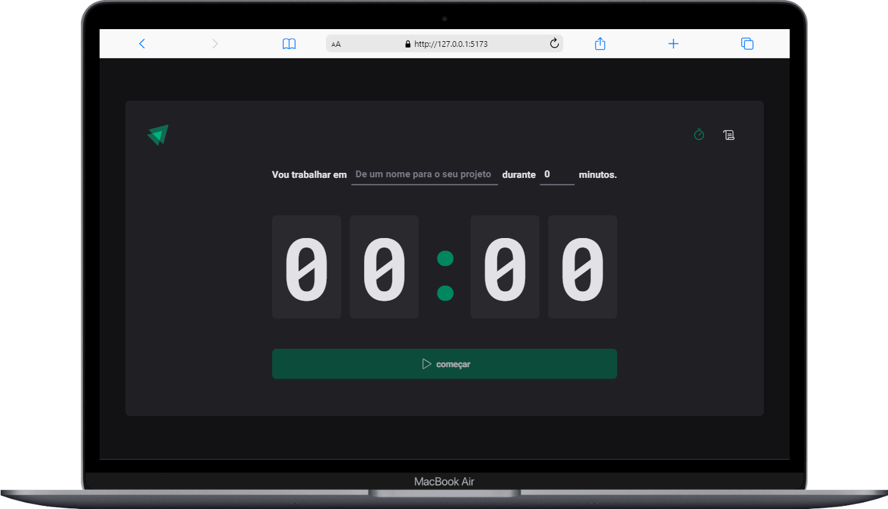
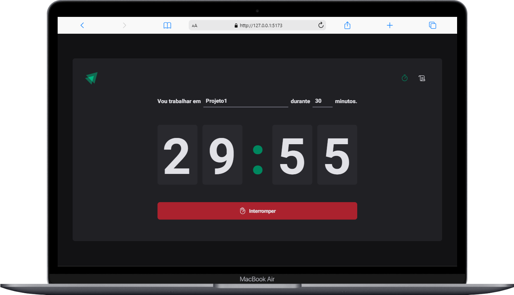
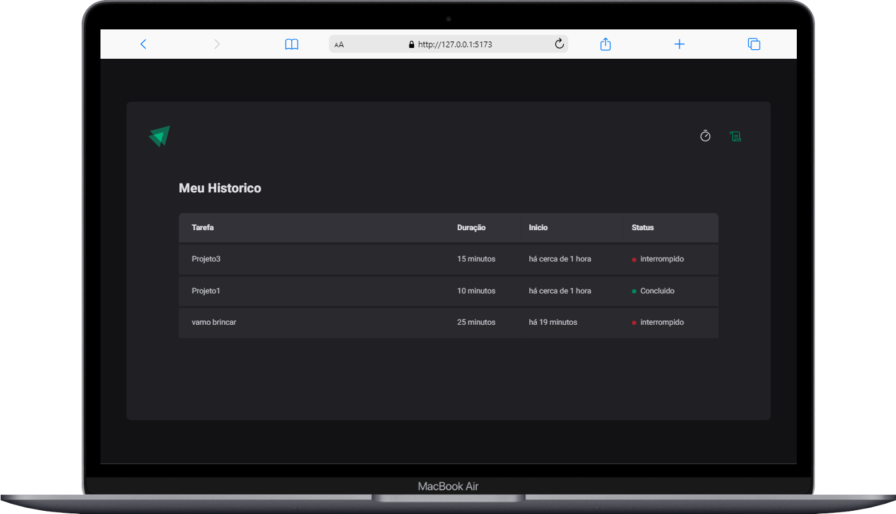

<h1 align="center"> IgniteTimer of trail react by rocketseat course 
</h1>

    
 

- site deployed : https://breno-okra-ignitetimer.netlify.app/

## 🚀 Techniques

this project was developed with technology:

- REACTJS E VITE
- Immer
- date-fns
- zod
- styled-components

## learning main

- zod
- Immer
- date-fns

## about

this project was developed in the level 2 of the trail reactJS by rocketseat, was developed an simple application of the timer for register yours time study.

## 💻 Photos Project

    <h3>Home </h3>
    
    <h3>Timer</h3>
    
      <h3>History</h3>
    
  

# React + Vite

This template provides a minimal setup to get React working in Vite with HMR and some ESLint rules.

Currently, two official plugins are available:

- [@vitejs/plugin-react](https://github.com/vitejs/vite-plugin-react/blob/main/packages/plugin-react/README.md) uses [Babel](https://babeljs.io/) for Fast Refresh
- [@vitejs/plugin-react-swc](https://github.com/vitejs/vite-plugin-react-swc) uses [SWC](https://swc.rs/) for Fast Refresh
